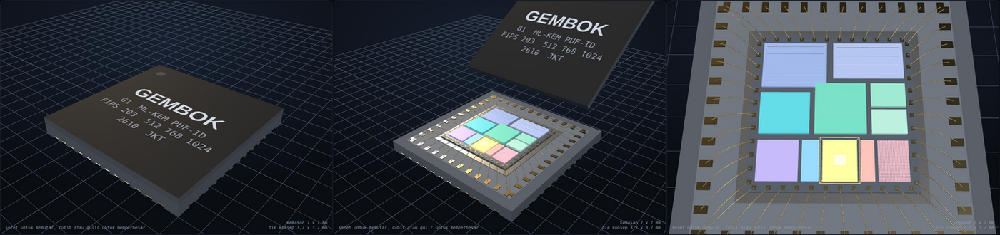

# GEMBOK

Chip identitas tahan kuantum berbasis ML-KEM (NIST FIPS 203) dengan kunci dari PUF, dirancang untuk papan DE10-Nano (Intel Cyclone V 5CSEBA6U23I7). Proyek PERURI Chip Hackathon 2026, kategori IC Chip Design & FPGA Implementation.

Chip membuktikan dirinya asli tanpa pernah mengeluarkan kunci rahasianya. Pemeriksa mengunci sebuah rahasia dengan kunci publik chip (Encaps). Hanya chip asli yang bisa membukanya (Decaps) dan mengembalikan bukti 32 byte. Kunci rahasia dibangkitkan ulang dari PUF di dalam chip setiap kali dibutuhkan, lalu dihapus.

## Arsitektur

Penjelasan tiap modul ada di [`docs/arsitektur.md`](docs/arsitektur.md).

## Model fisik chip

Coba model 3D interaktifnya langsung di **[gembok-dashboard.vercel.app](https://gembok-dashboard.vercel.app/)**. Sumbernya [`index.html`](index.html), satu berkas statis tanpa proses build. Kemasan bisa diputar, dibuka, dan tiap blok di die bisa diketuk untuk melihat berkas RTL dan angkanya. Letak dan luas blok adalah ilustrasi konsep bentuk ASIC, bukan hasil tata letak. Prototipe saat ini berjalan di FPGA DE10-Nano.

## Simulasi kasus nyata

Coba palsukan dokumen ber-chip GEMBOK di **[gembok-dashboard.vercel.app/simulasi](https://gembok-dashboard.vercel.app/simulasi/)**. Ada empat kasus (paspor elektronik di autogate, ijazah digital, pita cukai, dan kartu akses) dan tiga cara pemalsuan: chip dikloning, chip tiruan mendaftarkan PUF-nya sendiri, dan bukti lama diputar ulang. Kriptografinya sungguhan dan berjalan di peramban: kode pemeriksa Go yang sama ([`sw/verifier/cmd/gembok-wasm`](sw/verifier/cmd/gembok-wasm/main.go)) dikompilasi ke WebAssembly, dengan ML-KEM-768 dari `crypto/mlkem`, tanda tangan LMS penerbit, dan SHA3-256. Chipnya dijalankan sebagai model perangkat lunak dengan peta register dan driver yang sama, dan jumlah siklusnya diambil dari simulasi RTL. Bangun ulang dengan `make simulasi`.

## Status

| Bagian | Status |
|---|---|
| Model acuan Python | selesai, 240 dari 240 vektor NIST |
| RTL inti ML-KEM (512, 768, 1024) | selesai, 240 dari 240 vektor NIST di simulasi RTL |
| RTL brankas, PUF, pemulih kunci, jembatan Avalon-MM | selesai, teruji di simulasi |
| Driver C dan program uji untuk HPS | selesai, 240 dari 240 vektor lewat driver terhadap RTL |
| Layanan pemeriksa (Go) dan dasbor (SvelteKit) | selesai, teruji dengan chip simulasi |
| Berkas proyek Quartus dan komponen Platform Designer | selesai, **belum dikompilasi di Quartus** |
| Kompilasi Quartus, uji di papan, karakterisasi PUF | belum, lihat `docs/panduan-papan.md` |

Semua hasil di bawah berasal dari simulasi. Belum ada yang dijalankan di papan.

## Hasil utama

| Ukuran | Hasil |
|---|---|
| Vektor NIST ACVP di RTL (Verilator) | 240 dari 240, langsung ke inti dan lewat bus Avalon-MM |
| Simulator kedua (Icarus Verilog) | jumlah siklus dan keluaran sama persis dengan Verilator |
| BUKTIKAN ML-KEM-768 (kunci dibangkitkan ulang, Decaps, bukti, penghapusan) | 45.357 siklus = 0,907 ms pada 50 MHz |
| KeyGen / Encaps / Decaps ML-KEM-768 | sekitar 18.100 / 21.200 / 29.800 siklus |
| Siklus Decaps untuk 10 masukan rahasia berbeda | sama persis (k = 2, 3, 4) |
| Uji mutasi: RTL yang sengaja dirusak | 16 dari 16 tertangkap |
| Perkiraan sumber daya (Yosys, bukan Quartus) | sekitar 7.000 sampai 9.000 ALM termasuk PUF, 3 DSP, sekitar 14 blok M10K |

Rincian ada di `docs/laporan-uji.md`.

## Struktur repositori

| Folder | Isi |
|---|---|
| `rtl/` | RTL SystemVerilog (16 berkas, 17 modul) |
| `model/`, `tests/`, `vectors/` | model acuan Python, ujinya, dan vektor NIST |
| `tools/` | pembangkit tabel langkah dan ROM zeta, simulator tabel langkah, uji mutasi, pengubah vektor, skrip perkiraan Yosys |
| `tb/` | testbench cocotb per modul dan tingkat atas |
| `quartus/` | proyek Quartus, batasan timing, skrip kompilasi, komponen Platform Designer |
| `sw/hps/` | driver C, `gembok-cli`, pengujian driver terhadap RTL lewat Verilator |
| `sw/verifier/` | layanan pemeriksa Go: penerbit sertifikat LMS, pemeriksaan, API HTTP |
| `sw/dashboard/` | dasbor demo SvelteKit |
| `docs/` | arsitektur, peta register, laporan uji, panduan papan, API |

## Menjalankan uji

Butuh Python 3.10 atau lebih baru, Verilator 5, Icarus Verilog 12 (opsional), cocotb 1.9, Go 1.24, dan Node 20.19 atau lebih baru (hanya untuk membangun ulang dasbor).

| Perintah | Isi |
|---|---|
| `pip install cocotb==1.9.2 pytest kyber-py` | pustaka Python untuk testbench dan uji silang |
| `make semua` | model, tabel langkah, lint, uji unit, 240 vektor NIST, 8 konfigurasi tingkat atas, driver C, layanan Go |
| `make mutasi` | uji mutasi RTL (sekitar 9 menit) |

Dari keadaan bersih `make semua` selesai sekitar 18 menit di mesin dua inti, sepertiganya untuk simulasi osilator perilaku. Uji bisa dijalankan sendiri-sendiri: `make model`, `make nist`, `make top`, `make hps`, `make verifier`. Testbench juga bisa dijalankan di Icarus dengan `make -C tb/mlkem SIM=icarus`.

## Dokumen

| Dokumen | Isi |
|---|---|
| [`docs/arsitektur.md`](docs/arsitektur.md) | rancangan tiap modul, jadwal pipa, tabel langkah, brankas, PUF, anggaran siklus, sumber daya |
| [`docs/peta-register.md`](docs/peta-register.md) | register, kode perintah, kode galat, peta memori, urutan pemakaian |
| [`docs/laporan-uji.md`](docs/laporan-uji.md) | semua uji, hasilnya, dan cara mengulanginya |
| [`docs/panduan-papan.md`](docs/panduan-papan.md) | langkah di Quartus dan di papan |
| [`docs/model-acuan.md`](docs/model-acuan.md) | model Python dan pemetaannya ke FIPS 203 |
| [`docs/api-pemeriksa.md`](docs/api-pemeriksa.md) | API HTTP layanan pemeriksa |
| [`docs/tabel-langkah.txt`](docs/tabel-langkah.txt) | daftar 250 langkah pengendali (dibangkitkan) |
| [`index.html`](index.html) | model 3D interaktif bentuk fisik chip, daring di [gembok-dashboard.vercel.app](https://gembok-dashboard.vercel.app/) |
| [`simulasi/index.html`](simulasi/index.html) | simulasi kasus nyata di peramban, daring di [gembok-dashboard.vercel.app/simulasi](https://gembok-dashboard.vercel.app/simulasi/) |

## Batas

- Belum dikompilasi di Quartus dan belum dijalankan di papan. Angka sumber daya masih perkiraan.
- PUF (mode osilator asli) bergantung pada fisik chip dan harus dikarakterisasi di papan. Penempatan osilator belum dikunci, jadi keunikan antarpapan dengan bitstream yang sama harus diukur (`docs/arsitektur.md` Bagian 10.5), dan setiap kompilasi ulang menuntut pendaftaran ulang.
- Tidak tahan serangan daya, elektromagnetik, injeksi galat, atau penyerang yang bisa mengganti bitstream.
- Layanan pemeriksa Go hanya mendukung ML-KEM-768 dan 1024, karena pustaka standar Go tidak punya ML-KEM-512.
- Lolos vektor ACVP bukan validasi resmi NIST.

## Lisensi

Hak cipta dilindungi. Tidak ada izin untuk menyalin, memakai, mengubah, atau menyebarkan isi repositori ini tanpa izin tertulis. Ketentuan lengkap ada di `LICENSE`.
