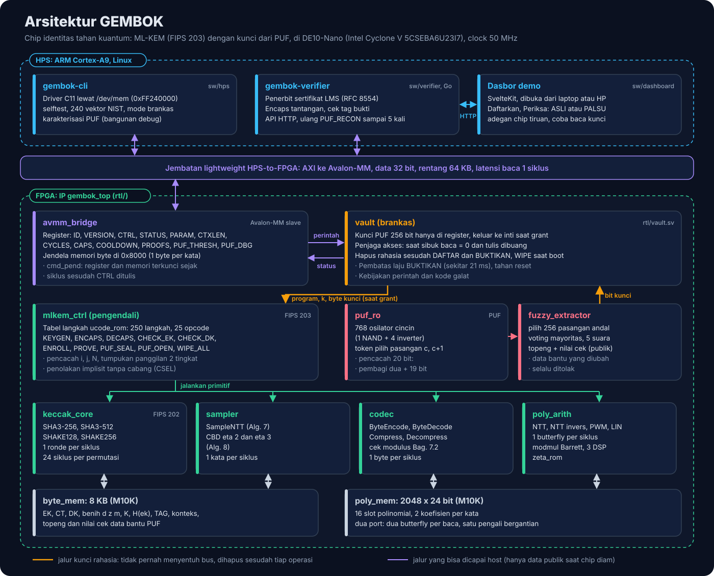
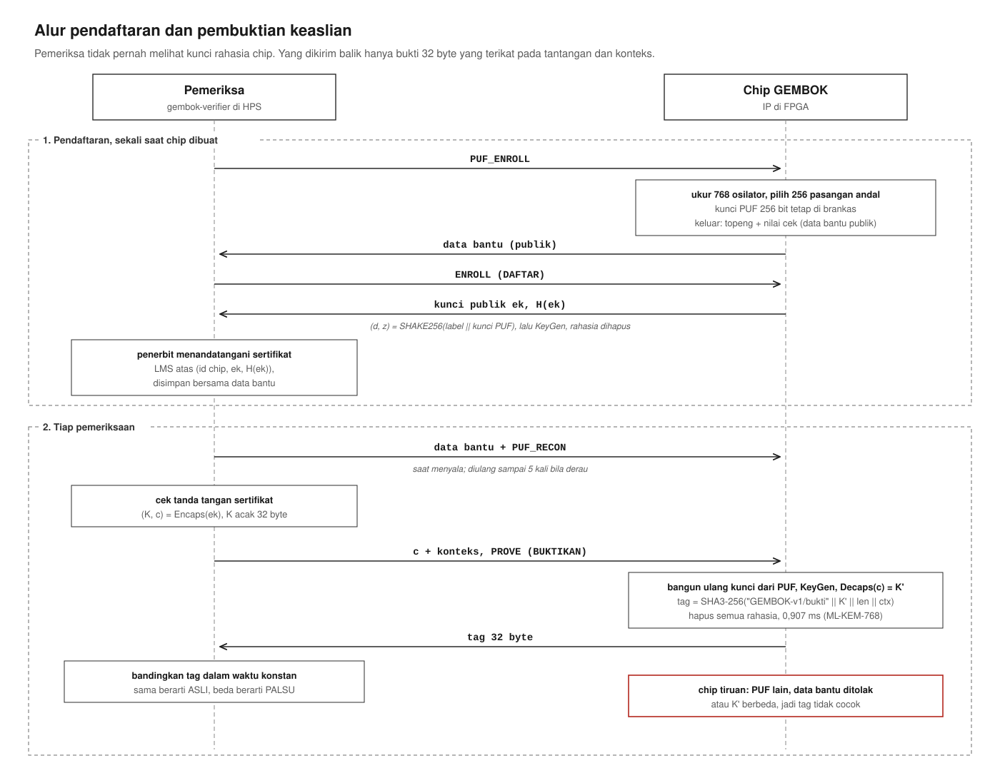

# Arsitektur RTL GEMBOK

Dokumen ini menjelaskan rancangan perangkat keras GEMBOK modul demi modul. Kode RTL sengaja ditulis tanpa komentar, jadi penjelasan rancangannya dikumpulkan di sini.

Semua rancangan diturunkan dari teks NIST FIPS 203 (ML-KEM) dan FIPS 202 (SHA-3), dengan model acuan Python di `model/` sebagai pembanding bit demi bit. Tidak ada kode dari implementasi lain yang dipakai.

## 1. Gambaran umum

GEMBOK terdiri atas dua lapis:

1. **Inti ML-KEM** (`mlkem_ctrl` dan unit-unit di bawahnya): KeyGen, Encaps, dan Decaps lengkap untuk ML-KEM-512, 768, dan 1024, termasuk pemeriksaan masukan FIPS 203 Bagian 7.2 dan 7.3.
2. **Brankas** (`vault`, `puf_ro`, `fuzzy_extractor`): kunci berasal dari PUF, kunci tidak punya jalur ke bus, memori rahasia dihapus setelah tiap operasi, host dikunci selama operasi berjalan, dan perintah BUKTIKAN dibatasi lajunya.

Host (HPS ARM di DE10-Nano) berbicara dengan IP lewat `avmm_bridge` (Avalon-MM). Peta register dan urutan pemakaian ada di [`docs/peta-register.md`](peta-register.md).

Prinsip rancangan: hemat area. Satu inti Keccak, satu pengali modular, satu butterfly, dan matriks A dibangkitkan saat dipakai lalu dibuang. Kecepatan dikejar lewat penjadwalan, bukan dengan memperbanyak unit.

## 2. Daftar modul

| Berkas | Modul | Peran |
|---|---|---|
| `keccak_round.sv` | `keccak_round` | Satu ronde Keccak-f[1600], kombinasional |
| `keccak_core.sv` | `keccak_core` | Spons SHA3-256, SHA3-512, SHAKE128, SHAKE256 |
| `modmul.sv` | `modmul` | Perkalian mod 3329, Barrett, 3 tahap |
| `zeta_rom.sv` | `zeta_rom` | Tabel zeta NTT (dibangkitkan `tools/gen_zeta_rom.py`) |
| `poly_arith.sv` | `poly_arith` | NTT, NTT invers, perkalian di domain NTT, operasi linear |
| `ram_tdp.sv` | `ram_tdp` | RAM dua port sejati (pola inferensi M10K) |
| `poly_mem.sv` | `poly_mem` | Memori polinomial 2048 x 24 bit |
| `sampler.sv` | `sampler` | SampleNTT, CBD eta 2, CBD eta 3 |
| `codec.sv` | `codec` | ByteEncode/Decode, Compress/Decompress |
| `ucode_rom.sv` | `ucode_rom` | Tabel langkah (dibangkitkan `tools/ucode.py`) |
| `mlkem_ctrl.sv` | `mlkem_ctrl` | Pengendali, memori byte, perutean data |
| `puf_ro.sv` | `ro_cell`, `puf_ro` | PUF ring oscillator dan model simulasinya |
| `fuzzy_extractor.sv` | `fuzzy_extractor` | Kunci stabil dari PUF dengan data bantu publik |
| `vault.sv` | `vault` | Brankas: kebijakan perintah, kunci, penjaga akses |
| `avmm_bridge.sv` | `avmm_bridge` | Antarmuka Avalon-MM |
| `gembok_top.sv` | `gembok_top` | Tingkat atas |

Ke-16 berkas memuat 17 modul (`ro_cell` dan `puf_ro` ada di satu berkas). Semua modul ditulis dalam subset kecil SystemVerilog (`logic`, `always_ff`, `always_comb`, `localparam`, fungsi otomatis) supaya diterima Quartus Prime Lite, Verilator, Icarus Verilog, dan Yosys. Tidak ada interface, struct, atau enum. Reset sinkron aktif tinggi, satu clock 50 MHz. Satu-satunya pengecualian adalah pencacah osilator PUF, yang diclock osilatornya sendiri dan dihapus secara asinkron (Bagian 10.1). Lint Verilator `-Wall` bersih tanpa pengecualian lebar bit.

## 3. Keccak

### 3.1 Ronde

`keccak_round` adalah terjemahan langsung FIPS 202 Bagian 3.2. Lajur A[x][y] berada di bit `64*(x + 5y)` sampai `64*(x + 5y) + 63`, dan byte ke-i pesan menempati bit `8i` sampai `8i + 7` dengan bit terendah lebih dulu. Dengan susunan ini, byte pesan langsung jatuh ke posisi state yang benar tanpa penataan ulang.

- theta: paritas kolom C[x], lalu D[x] = C[x-1] XOR rotl(C[x+1], 1).
- rho dan pi: B[y][(2x + 3y) mod 5] = rotl(A[x][y] XOR D[x], r[x][y]). Geseran r diambil dari Tabel 2 FIPS 202 lewat fungsi konstan.
- chi: A[x][y] = B[x][y] XOR (NOT B[x+1][y] AND B[x+2][y]).
- iota: lajur (0, 0) di-XOR dengan konstanta ronde.

### 3.2 Spons

`keccak_core` menjalankan satu ronde per siklus, jadi satu permutasi 24 siklus.

| Mode | Laju (byte) | Akhiran domain |
|---|---|---|
| 0 SHA3-256 | 136 | 0x06 |
| 1 SHA3-512 | 72 | 0x06 |
| 2 SHAKE128 | 168 | 0x1F |
| 3 SHAKE256 | 136 | 0x1F |

- **Serap.** Satu byte per siklus. Byte di-XOR ke posisi penunjuk `ptr` lewat dekoder per byte, jadi tidak ada penggeseran state. Bila blok penuh, permutasi jalan dan penyerapan berhenti sementara (`a_ready` turun).
- **Penutup.** `finish` meng-XOR akhiran domain di posisi `ptr` dan 0x80 di byte terakhir blok (bisa byte yang sama), lalu permutasi.
- **Peras.** Bagian laju dibaca per kelompok 3 byte lewat mux 56 masukan ke register `hold`. Dari situ keluaran bisa diambil per byte (`q_*`, untuk hash dan CBD) atau per 3 byte sekaligus (`t_*`, untuk SampleNTT). Bila blok habis, permutasi berikutnya jalan sendiri.
- **init** selalu menang atas keadaan lain dan mengosongkan state. Ini juga dipakai untuk menghapus state Keccak di akhir program brankas.

## 4. Memori

### 4.1 Memori polinomial

`poly_mem` = RAM dua port sejati 2048 x 24 bit (16 slot x 128 kata). Satu kata menyimpan dua koefisien bersebelahan: bit 11..0 = f[2w], bit 23..12 = f[2w+1]. Alamat = {slot (4 bit), kata (7 bit)}.

Pembagian slot oleh tabel langkah:

| Slot | Isi |
|---|---|
| 0..3 | s (KeyGen, Decaps), lalu y (Encaps, enkripsi ulang) |
| 4..7 | e lalu t (KeyGen), t (Encaps, Decaps) |
| 8 | ACC, akumulator |
| 9 | TMP: elemen matriks A, e1, e2, u, v, atau mu |

Untuk k = 4 terpakai 2k + 2 = 10 slot. Kunci rahasia s dan t tidak perlu disimpan sebagai byte selama Decaps, jadi Decaps di mode brankas tidak pernah menulis dk ke memori byte.

### 4.2 Memori byte

`byte_mem` (di dalam `mlkem_ctrl`) = RAM dua port 8192 x 8 bit. Port A dipakai inti, port B dipakai host lewat brankas. Petanya ada di `docs/peta-register.md`. Seluruh data byte (kunci, ciphertext, benih, hash, konteks, data bantu PUF) ada di satu memori ini, sehingga semua primitif memakai satu cara pengalamatan: deskriptor (alamat dasar, panjang).

## 5. Aritmetika polinomial

### 5.1 Perkalian modular

`modmul` menghitung x * y mod 3329 untuk x, y di [0, 3329):

1. p = x * y (24 bit)
2. m = (p * 5039) >> 24, dengan 5039 = floor(2^24 / 3329)
3. r = p - m * 3329, lalu satu pengurangan bersyarat

Untuk semua p sampai 3328^2 berlaku 0 <= r < 2 * 3329 (diperiksa menyeluruh), jadi satu koreksi cukup dan r cukup dihitung pada 13 bit terendah. m * 3329 dihitung dengan geser-jumlah karena 3329 = 2^11 + 2^10 + 2^8 + 1. Modul diuji menyeluruh atas 3329 x 3329 pasangan masukan (`tb/modmul`).

Pipa: masukan diregister, lalu hasil kali, lalu m. Hasil `t` tersedia kombinasional 3 siklus setelah masukan, dan `t_r` (teregister) 4 siklus setelah masukan.

### 5.2 Trik pasangan koefisien

Lapis NTT ML-KEM yang paling pendek punya panjang blok 2 (tidak ada lapis panjang 1). Akibatnya dua koefisien f[2w] dan f[2w+1] tidak pernah saling menjadi pasangan butterfly, dan butterfly (f[j], f[j+len]) serta (f[j+1], f[j+1+len]) dengan j genap selalu memakai zeta yang sama.

Jadi satu baca kata A dan satu baca kata B memberi operand untuk dua butterfly. Dua baca (satu siklus, dua port) ditambah dua tulis (satu siklus, dua port) melayani dua butterfly. Dengan satu pengali yang dipakai bergantian, laju rata-rata menjadi satu butterfly per siklus tanpa perlu menata ulang memori di antara lapis.

### 5.3 Mesin dua fase (NTT, NTT invers, LIN)

T = siklus baca dikeluarkan.

| Siklus | Kejadian |
|---|---|
| T | baca kata A dan kata B (port A dan B) |
| T+1 | data tiba. Butterfly paruh bawah masuk pengali, paruh atas disimpan |
| T+2 | butterfly paruh atas masuk pengali |
| T+5 | hasil butterfly bawah keluar dari penambah/pengurang |
| T+6 | hasil butterfly atas keluar |
| T+7 | tulis kata A dan kata B |

Baca selalu di siklus genap dan tulis di siklus ganjil, jadi port tidak pernah bentrok. Di dalam satu lapis tiap kata hanya disentuh satu pasangan, jadi tidak ada bahaya baca sebelum tulis. Di awal tiap lapis mesin menunggu pipa kosong (8 siklus) sebelum membaca lagi.

Alamat dan zeta untuk lapis l (l = 0 untuk panjang blok 128, l = 6 untuk panjang blok 2) dan pasangan n (0..63):

- blok = n >> (6 - l), jw = n mod 2^(6 - l)
- kata A = blok * 2^(7 - l) + jw, kata B = kata A + 2^(6 - l)
- NTT: zeta ke-(2^l + blok). NTT invers: zeta ke-(2^(l+1) - 1 - blok), yang sama dengan bit blok dibalik.

Butterfly:

- NTT (Cooley-Tukey, Algoritma 9): a' = a + zeta*b, b' = a - zeta*b
- NTT invers (Gentleman-Sande, Algoritma 10): a' = a + b, b' = zeta*(b - a)

NTT invers di RTL **tidak** mengalikan hasil akhir dengan 3303 (= 128^-1 mod q). Perkalian itu digabung ke operasi LIN yang selalu menyusul NTT invers, jadi tidak ada lintasan tambahan.

LIN memakai butterfly yang sama: a = y (port A), b = x (port B), w = 3303 atau 1, lalu hasil a' (y + w*x) atau b' (y - w*x) ditulis ke slot tujuan. Slot tujuan boleh sama dengan x atau y.

Jumlah siklus terukur: NTT 940, NTT invers 940, LIN 264.

### 5.4 Mesin empat fase (PWM)

Perkalian di domain NTT (Algoritma 11 dan 12) untuk pasangan (a0, a1) dan (b0, b1):

- c0 = a0*b0 + a1*b1*gamma
- c1 = a0*b1 + a1*b0 = (a0 + a1)(b0 + b1) - a0*b0 - a1*b1 (Karatsuba)

Empat perkalian per kata, satu pengali, jadi satu kata per 4 siklus:

| Siklus | Masuk pengali | Lain |
|---|---|---|
| T | | baca kata a dan b |
| T+1 | a1 * b1 | baca kata akumulator |
| T+2 | a0 * b0 | |
| T+3 | (a0 + a1) * (b0 + b1) | ambil gamma |
| T+4 | (a1 * b1) * gamma | hasil a1*b1 diumpankan langsung dari keluaran kombinasional pengali |
| T+5 .. T+8 | | akumulasi r1 = acc1 - m1 - m0 + m2 dan r0 = acc0 + m0 + m3 |
| T+9 | | tulis kata hasil |

gamma untuk kata w tidak butuh tabel sendiri: gamma[2j] = ZETAS[64 + j] dan gamma[2j + 1] = q - ZETAS[64 + j].

Jumlah siklus terukur: 520. Mode akumulasi (`dst += a o b`) membaca akumulator, mode biasa menganggapnya nol.

## 6. Sampler

- **SampleNTT** (Algoritma 7). Keccak dibaca per 3 byte. d1 = 12 bit bawah, d2 = 12 bit atas. Kandidat >= 3329 dibuang. Kandidat diterima dikumpulkan berpasangan menjadi kata; bila ganjil, satu koefisien ditahan menunggu pasangannya. Paling banyak satu tulis kata per siklus. 3 blok SHAKE128 biasanya cukup, sekali-sekali 4 blok. Lamanya bergantung pada rho, yang publik. Terukur 226 sampai 271 siklus per polinomial.
- **CBD eta 2** (Algoritma 8). Satu byte = dua koefisien = satu kata per siklus. 153 siklus.
- **CBD eta 3** (hanya ML-KEM-512). 12 bit per kata, dikumpulkan dari aliran byte. 242 siklus.

## 7. Kodek

### 7.1 Dekode (byte ke kata)

Penampung bit 32 bit. Tiap siklus: bila ada paling sedikit 2d bit, satu pasangan nilai d bit diambil; bila masih ada tempat, satu byte baru masuk. Jumlah byte yang diambil dihitung, jadi dekode tidak pernah mengambil byte melebihi 32d.

- d = 12: nilai >= 3329 direduksi mod q dan `range_err` naik. Ini dipakai untuk cek modulus kunci enkapsulasi (Bagian 7.2).
- d lain: Decompress_d(y) = (3329*y + 2^(d-1)) >> d, dengan 3329*y dari geser-jumlah.

### 7.2 Enkode (kata ke byte)

Kata dibaca dari memori, koefisien diproses satu per siklus, dikompresi, lalu dikemas ke penampung keluaran 48 bit dan dikeluarkan satu byte per siklus.

Compress_d(x) = floor((2^d * x + 1664) / 3329) mod 2^d. Pembagian diganti perkalian: floor(N / 3329) = (N * 2580335) >> 33, benar untuk semua N < 2^23 (diperiksa menyeluruh). Satu pengali konstanta melayani semua d.

Aliran diatur dengan pencacah `commit`: koefisien baru hanya masuk bila bit yang sudah dijanjikan ke penampung ditambah d tidak melebihi 48. Ini mencegah luapan walau keluaran tertahan, dan pada keadaan normal laju keluaran tetap satu byte per siklus.

Terukur: dekode 131 (d=1, 4), 163 (d=5), 323 (d=10), 355 (d=11), 387 (d=12) siklus. Enkode 261 (d=1, 4, 5), 325 (d=10), 357 (d=11), 389 (d=12) siklus.

## 8. Pengendali dan tabel langkah

### 8.1 Gagasan

Urutan KeyGen, Encaps, dan Decaps ditulis sebagai program pendek di `tools/ucode.py`, mengikuti pseudokode FIPS 203 baris demi baris. Program dirakit menjadi kata 26 bit dan ditulis ke `rtl/ucode_rom.sv`. `mlkem_ctrl` membaca satu langkah, menjalankan satu primitif, menunggu selesai, lalu lanjut. Daftar lengkap langkah yang bisa dibaca ada di `docs/tabel-langkah.txt` (250 langkah).

Program yang sama dijalankan `tools/ucode_sim.py` di atas primitif model acuan. Dengan begitu urutan langkah dan pengodeannya sudah lolos 240 vektor NIST sebelum RTL disimulasikan, dan kesalahan urutan bisa dipisahkan dari kesalahan jalur data.

### 8.2 Format kata

`op[25:21] | f1[20:14] | f2[13:7] | f3[6:0]`, dengan `imm = {f2, f3}`.

- Operand slot (6 bit): bit 5..4 pilihan (0 tetap, 1 tambah i, 2 tambah j), bit 3..0 slot dasar. Bit ke-7 field dipakai untuk opsi PWM dan LIN.
- Operand wilayah byte (5 bit): nomor deskriptor. Alamat dan panjangnya dihitung dari k dan i, misalnya `EK_T_I` = alamat 384*i, panjang 384, dan `CT_U_I` = 0x800 + 32*du*i, panjang 32*du.

### 8.3 Daftar langkah

| Kode | Langkah | Arti |
|---|---|---|
| 0 | NOP | |
| 1 | END s | selesai dengan status s |
| 2, 3, 4 | JMP, CALL, RET | lompat, panggil (tumpukan 2 tingkat), kembali |
| 5, 6 | LOOPI t, LOOPJ t | i (atau j) tambah satu, lompat ke t bila belum sama dengan k |
| 7 | SETR r, v | isi i, j, N, atau bendera neq, cmp, bad |
| 8 | INCN | N tambah satu (nonce PRF) |
| 9 | BRF f, t | lompat bila bendera f menyala (hanya bendera publik) |
| 10 | HINIT m | mulai hash mode m |
| 11 | HABS d | serap wilayah byte d |
| 12 | HABSC c | serap satu byte tetap: literal, i, j, N, k, atau panjang konteks |
| 13 | HFIN | akhiri penyerapan |
| 14 | HSQZ d | peras ke wilayah d, atau bandingkan dengan isinya |
| 15 | SNTT s | SampleNTT ke slot s |
| 16 | CBD s, e | CBD eta1 atau eta2 ke slot s |
| 17 | DEC s, d | dekode wilayah d ke slot s, bisa sekaligus diserap Keccak dan dicek modulusnya |
| 18 | ENC s, d | enkode slot s ke wilayah d, atau bandingkan dengan isinya |
| 19, 20 | NTT s, INTT s | |
| 21 | PWM | dst = a o b atau dst += a o b (bisa bersyarat i > 0 atau j > 0) |
| 22 | LIN | dst = y + w*x atau y - w*x, w = 3303 atau 1 |
| 23 | CSEL | dst = neq ? alt : dst, 32 byte, selalu menulis |
| 24 | WIPE m | hapus memori polinomial, slot rahasia, state Keccak, atau seluruh memori byte |

### 8.4 Program

| No | Program | Isi |
|---|---|---|
| 0 | WIPE_ALL | dijalankan otomatis sesudah reset |
| 1 | KEYGEN | Algoritma 16: kg_core, enkode ek, H(ek), enkode dk_pke |
| 2 | ENCAPS | Algoritma 17: dekode t sambil menyerap ek untuk H(ek) dan cek modulus, G(m, H(ek)), enc_core |
| 3 | DECAPS | Algoritma 18: dekode s dan t, cek hash Bagian 7.3, dec_core |
| 4 | CHECK_EK | Bagian 7.2 |
| 5 | CHECK_DK | Bagian 7.3 |
| 6 | ENROLL | v_seeds, kg_core, enkode ek dan H(ek), hapus rahasia |
| 7 | PROVE | v_seeds, kg_core, ek dan H(ek), dec_core, tag, hapus rahasia |
| 8 | PUF_SEAL | nilai cek data bantu |
| 9 | PUF_OPEN | periksa nilai cek data bantu |

Beberapa keputusan di dalam program:

- **J(z, c) diserap sambil mendekode c.** Di dec_core, Keccak dimulai dengan z, lalu byte c yang sedang didekode ikut diserap. K_bar keluar tanpa membaca c dua kali.
- **H(ek) diserap sambil mendekode t** pada Encaps dan Decaps.
- **Penolakan implisit tanpa cabang.** Enkripsi ulang di dec_core berjalan dalam mode banding: byte c' dibandingkan dengan c dan bendera `neq` menyala bila ada beda. K akhir dipilih CSEL yang selalu membaca dan menulis 32 byte.
- **Nonce N** dihitung dengan INCN, sehingga urutan y, e1, e2 mengikuti Algoritma 14 tanpa angka tetap di program.

### 8.5 Sifat waktu konstan

- Satu-satunya cabang adalah LOOPI/LOOPJ (bergantung k) dan BRF (bergantung hasil cek masukan, yang publik).
- Lama SampleNTT bergantung pada rho, yang publik.
- Pembandingan c dan c' tidak pernah berhenti di tengah. CSEL selalu 96 siklus.
- Uji `siklus_konstan` mengukur Decaps pada 10 masukan rahasia berbeda per tingkat (pesan berbeda, ciphertext rusak, dan s serta z lain dengan ek yang sama): jumlah siklusnya selalu sama.

## 9. Brankas

`vault` menerima perintah dari jembatan, memutuskan boleh tidaknya, lalu menjalankan program inti atau proses PUF.

- **Kunci PUF** 256 bit hanya ada di register `key`. Inti membaca per byte lewat `puf_idx`, dan brankas hanya menjawab saat `grant` menyala, yaitu selama program ENROLL, PROVE, PUF_SEAL, atau PUF_OPEN. Program mode terbuka tidak pernah mendapat kunci.
- **Penjaga akses.** Port host ke memori byte hanya tersambung saat brankas diam. Saat sibuk, alamat dari host diabaikan, tulisan dibuang, dan data baca dipaksa nol. Data baca juga dipaksa nol pada siklus pertama sesudah sibuk, supaya bacaan yang alamatnya ditangkap saat sibuk tidak lolos. Tulisan memori pada siklus tepat sesudah CTRL juga dibuang oleh jembatan (Bagian 11).
- **Penghapusan.** ENROLL dan PROVE diakhiri WIPE: seluruh memori polinomial, slot D, Z, M, K, SIGMA, KBAR, dan state Keccak. Sesudah reset, WIPE_ALL menghapus seluruh memori polinomial dan memori byte sebelum perintah pertama diterima.
- **Pembatas laju.** Setelah PROVE, perintah PROVE berikutnya ditolak (galat 6) sampai hitung mundur `COOLDOWN_CYCLES` habis. Bawaan 1.048.576 siklus (sekitar 21 ms, paling banyak sekitar 47 bukti per detik). Tujuannya membatasi laju pengumpulan jejak untuk serangan saluran samping dengan ciphertext pilihan.
  - Reset tidak mengosongkan hitung mundur, jadi urutan reset, PUF_RECON, PROVE tidak melewati jeda. Hitung mundur berhenti selama reset lalu berlanjut. Hanya konfigurasi ulang FPGA (nilai awal register) yang mengembalikannya ke nol sebelum habis.
  - ENROLL tidak dibatasi. ENROLL menjalankan KeyGen rahasia yang sama dengan PROVE, tetapi tanpa masukan dari luar, dan memang dibutuhkan saat pendaftaran. Jejak KeyGen yang tidak terbatas hanya berguna bagi serangan daya atau elektromagnetik, yang di luar cakupan rancangan ini (Bagian 14).
- **Penguncian register.** Selama sibuk, semua tulisan register diabaikan dan k serta panjang konteks dikunci saat perintah diterima.

Turunan kunci:

- (d, z) = SHAKE256("GEMBOK-v1/benih" || kunci PUF), 64 byte.
- Tag = SHA3-256("GEMBOK-v1/bukti" || K || panjang konteks || konteks).
- Nilai cek data bantu = SHAKE256("GEMBOK-v1/cek" || kunci PUF || topeng), 16 byte.

## 10. PUF dan pemulih kunci

### 10.1 Osilator

`puf_ro` memuat N_RO osilator cincin (bawaan 768). Tiap osilator = satu gerbang NAND (masukan aktif) dan STAGES - 1 inverter (bawaan 5 tahap). Osilator yang mati keluarannya 1.

STAGES harus ganjil. Dengan jumlah pembalik genap, cincin mengunci alih-alih berosilasi, dan cincin yang mati keluarannya 0. Nilai 0 itu menahan gerbang AND bersama (lihat di bawah) sehingga osilator yang aktif pun tidak terhitung. Komponen Platform Designer hanya menerima 3, 5, 7, 9, 11, dan 13.

"Pasangan c" adalah osilator c dan c+1. Satu pengukuran menyalakan keduanya selama 2^WIN_LOG2 siklus clk (bawaan 4096 siklus = 81,92 mikrodetik), menghitung tepi naik masing-masing dengan pencacah 20 bit yang diclock oleh osilator itu sendiri, lalu membandingkan:

- bit = 1 bila hitungan osilator c lebih besar dari osilator c+1
- andal = 1 bila selisihnya paling sedikit ambang (`PUF_THRESH`)

Osilator bernomor genap disatukan dengan gerbang AND ke pencacah A, yang ganjil ke pencacah B. Karena osilator mati bernilai 1, AND seluruh sisi sama dengan sinyal satu-satunya osilator yang menyala, jadi tidak perlu mux. Osilator yang aktif dipilih register token satu bit yang berjalan. Pencacah dibaca setelah osilator berhenti dan diberi waktu tenang 8 siklus, sehingga tidak ada persilangan domain clock yang berbahaya.

Pencacah:

- Bit terendah adalah flip-flop pembagi dua yang diclock langsung oleh osilator. Sembilan belas bit sisanya mencacah tepi turun flip-flop itu, jadi pencacah biner hanya perlu berjalan pada separuh frekuensi osilator. Nilai yang dibaca tetap sama dengan jumlah tepi naik osilator.
- Penghapusan pencacah (`clr`) dilepas satu siklus clk sebelum osilator dinyalakan, jadi pencacah sudah bebas sebelum tepi osilator pertama.
- Lebar 20 bit tidak meluap sampai 1.048.575 tepi per jendela, yaitu sekitar 12,8 GHz pada WIN_LOG2 = 12. WIN_LOG2 dibatasi 4 sampai 16.
- `quartus/gembok_puf.sdc` mendefinisikan jam osilator (`puf_osc_a`, `puf_osc_b`, periode 2,5 ns atau 400 MHz) dan jam pembagi dua (`puf_half_a`, `puf_half_b`, 5 ns), sehingga Timing Analyzer memeriksa bahwa pencacah sanggup mengikuti osilator sampai 400 MHz. Jalur antara pencacah dan domain clk dipotong karena pencacah dihapus sebelum osilator menyala dan dibaca setelah osilator berhenti. Berkas yang sama ikut dalam komponen Platform Designer.
- Frekuensi osilator di papan dihitung dari hitungan PUF_MEASURE: f = hitungan / (2^WIN_LOG2 x 20 ns). Pada WIN_LOG2 = 12, 400 MHz sama dengan hitungan 32.768. Bila osilator lebih cepat, periode di SDC harus diperkecil lalu dikompilasi ulang.

Bagian ini bergantung pada fisik chip dan belum diuji di papan. N_RO, STAGES, WIN_LOG2, dan ambang perlu ditala setelah pengukuran (`docs/panduan-papan.md` Langkah 5).

### 10.2 Pemulih kunci

`fuzzy_extractor` memakai **pemilihan pasangan andal** dan **voting mayoritas**:

- **Pendaftaran** (sekali). Tiap pasangan diukur VOTES kali (bawaan 5). Pasangan dipilih bila semua pengukuran selisihnya paling sedikit ambang dan arahnya sama. Pasangan sesudah pasangan terpilih dilewati, sehingga tidak ada osilator yang dipakai dua kali dan bit kunci saling bebas. Pemilihan berhenti setelah 256 pasangan. Hasilnya topeng N_RO - 1 bit ((N_RO + 6) / 8 byte, 96 byte untuk bawaan): bit c = 1 berarti pasangan c dipakai. Bit kunci ke-n adalah arah pasangan terpilih ke-n.
- **Pemulihan** (tiap menyala). Hanya pasangan bertanda yang diukur, masing-masing VOTES kali, dan bit kunci = suara terbanyak. Berhasil bila tepat 256 bit diperoleh.

Topeng hanya menyatakan pasangan mana yang dipakai, bukan nilai bitnya, jadi topeng boleh publik.

Batas parameter (juga dipaksakan oleh komponen Platform Designer):

- VOTES ganjil, 1 sampai 15, supaya tidak pernah ada suara seri.
- N_RO 600 sampai 1025. Aturan lewati-sesudah-terpilih membuat paling banyak sekitar N_RO / 2 pasangan bisa terpilih, jadi N_RO di bawah 512 pasti gagal dan di bawah sekitar 600 hampir pasti PUF_FAIL. Di atas 1025 topeng melewati 128 byte dan menabrak HELPER_CHK di 0x1A80. Perangkat lunak membaca N_RO, VOTES, dan WIN_LOG2 dari CAPS, lalu menghitung panjang topeng dan batas waktu perintah PUF sendiri. Satu pengukuran memakan sekitar 2^WIN_LOG2 + 16 siklus dan setiap pasangan diukur VOTES kali, jadi PUF_ENROLL dan PUF_RECON paling lama sekitar (N_RO - 1) x (VOTES x (2^WIN_LOG2 + 32) + 16) + 100.000 siklus: sekitar 0,32 detik dengan parameter bawaan, sekitar 20 detik pada batas terbesar (1025 osilator, 15 suara, WIN_LOG2 = 16).

### 10.3 Mengapa ada nilai cek

Tanpa pengaman, penyerang yang bisa mengubah data bantu bisa menukar satu pasangan di topeng lalu melihat apakah kunci (lewat EK hasil DAFTAR) berubah. Itu membocorkan hubungan antar bit kunci satu per satu.

Karena itu PUF_ENROLL menyimpan nilai cek = SHAKE256(label || kunci || topeng). PUF_RECON baru menerima kunci bila nilai cek hasil hitung ulang sama dengan yang tersimpan. Topeng yang diubah sedikit pun selalu ditolak (galat 3 atau 8), kunci dibuang, dan DAFTAR serta BUKTIKAN menolak dengan galat 5. Uji `data_bantu_diubah` dan `chip_tiruan` memeriksa ini.

### 10.4 Model simulasi

Dengan `PUF_MODE = 1`, tiap osilator diberi "frekuensi" tetap dari fungsi pengaduk bilangan bulat atas (CHIP_SEED, nomor osilator), ditambah derau acak 0..SIM_NOISE per pengukuran. Rumusnya sama persis dengan `tb/common/puf_model.py`, sehingga topeng dan kunci hasil RTL bisa dibandingkan dengan model Python. CHIP_SEED yang berbeda berperan sebagai chip lain.

Cabang osilator asli (`PUF_MODE = 0`) juga disimulasikan. Dengan makro `GEMBOK_SIM_RO`, isi `ro_cell` diganti osilator perilaku yang setengah periodenya tetap per osilator (dari fungsi pengaduk yang sama). Token, gerbang AND, pembagi dua, dan pencacah yang dipakai tetap sama dengan yang disintesis. Uji `ro_daftar_dan_pulih` menjalankan pendaftaran dan pemulihan lewat jalur itu, dan `ro_hitungan_20_bit` memeriksa bahwa hitungan di atas 65.535 terbaca utuh. Yang tidak bisa disimulasikan adalah perilaku listrik cincin di FPGA.

### 10.5 Batas

- Entropi kunci bergantung pada kualitas osilator di chip nyata. Pemilihan pasangan saling bebas memberi paling banyak 256 bit bila arah tiap pasangan tidak bias. Ini harus diukur.
- Pendaftaran ulang bisa dilakukan kapan saja oleh host. Pada produk, pendaftaran seharusnya dikunci sesudah keluar pabrik (sekering), yang tidak tersedia di FPGA.
- Pemilihan ambang yang terlalu rendah membuat pemulihan sesekali gagal. Kegagalan itu selalu terdeteksi oleh nilai cek, tidak pernah menghasilkan kunci yang salah diam-diam (uji `ambang_rendah_terdeteksi`). Karena itu pemeriksa mengulang PUF_RECON beberapa kali sebelum menyatakan chip palsu.
- Penempatan osilator tidak dikunci. Quartus menempatkan dan merutekan tiap osilator secara bebas, jadi selisih frekuensi dalam satu pasangan bisa didominasi perbedaan rute. Perbedaan rute itu sama di setiap papan yang memakai bitstream yang sama, sehingga dua papan dengan `.rbf` yang sama mungkin memberi kunci yang mirip. Keunikan antarchip harus diukur dengan papan kedua yang memakai `.rbf` yang sama (`docs/panduan-papan.md` Langkah 5). Perbaikan yang disarankan: tata letak osilator dikunci dengan Logic Lock region atau penempatan per sel, kedua anggota pasangan bersebelahan dan berbentuk sama.
- Kompilasi ulang apa pun (parameter, perubahan GHRD, versi Quartus lain) bisa memindahkan osilator, sehingga data bantu dan sertifikat lama tidak berlaku lagi. Bitstream demo harus dibekukan, dan chip didaftarkan ulang setiap kali bitstream berubah.

## 11. Jembatan Avalon-MM

- Data 32 bit, alamat kata 14 bit (rentang 64 KB), latensi baca tetap 1 siklus, tanpa waitrequest.
- Bit 13 alamat memilih jendela memori byte (satu byte per kata bus).
- **cmd_pend.** Perintah dari CTRL masuk ke brankas satu siklus setelah ditulis. Selama satu siklus itu jembatan sudah melaporkan BUSY = 1 dan DONE = 0, dan tulisan register maupun memori diabaikan. Jadi STATUS yang dibaca tepat sesudah CTRL tidak pernah menampilkan hasil perintah sebelumnya, dan perintah selalu memakai masukan yang ada saat CTRL ditulis.

## 12. Anggaran siklus

Terukur di simulasi RTL lewat register CYCLES, yaitu yang dilihat host (siklus clock 50 MHz):

| Operasi | k = 2 | k = 3 | k = 4 |
|---|---|---|---|
| KeyGen | 10.870 sampai 10.923 | 18.069 sampai 18.123 | 27.228 sampai 27.322 |
| Encaps | 13.467 sampai 13.507 | 21.169 sampai 21.249 | 30.803 sampai 30.867 |
| Decaps | 19.763 sampai 19.795 | 29.730 sampai 29.805 | 41.742 sampai 41.828 |
| CHECK_EK | 795 | 1.187 | 1.579 |
| CHECK_DK | 995 | 1.451 | 1.907 |
| DAFTAR (ENROLL) | 11.294 | 18.110 | 26.884 |
| BUKTIKAN, konteks kosong | 29.417 | 45.357 | 65.299 |

Rentang KeyGen, Encaps, dan Decaps berasal dari 25 atau 10 vektor NIST yang berbeda. Selisihnya hanya karena lama SampleNTT bergantung pada rho, yang publik. Untuk satu kunci yang sama, Decaps selalu memakan jumlah siklus yang sama, baik ciphertext sah maupun ditolak (uji `siklus_konstan`). Angka DAFTAR dan BUKTIKAN memakai kunci pengembangan, sehingga rho-nya tetap. Dengan kunci PUF, rho ikut berubah, jadi jumlahnya bisa berbeda beberapa puluh siklus.

BUKTIKAN ML-KEM-768 = 45.357 siklus = 0,907 ms pada 50 MHz. Angka di atas sudah termasuk pembangkitan ulang kunci dari PUF, Decaps lengkap dengan enkripsi ulang, tag, dan penghapusan seluruh memori rahasia (1.024 siklus).

Perkiraan pembagian waktu BUKTIKAN ML-KEM-768:

| Bagian | Isi | Perkiraan siklus |
|---|---|---|
| Benih | SHAKE256 atas label dan kunci PUF | sekitar 150 |
| KeyGen | 6 NTT, 9 SampleNTT, 9 PWM, 6 CBD | sekitar 14.000 |
| ek dan H(ek) | 3 enkode d=12, SHA3-256 atas 1.184 byte | sekitar 2.700 |
| Dekripsi | dekode u dan v sambil menyerap J, 3 NTT, 3 PWM, 1 NTT invers, LIN, enkode m' | sekitar 7.500 |
| G(m', h) | SHA3-512 | sekitar 200 |
| Enkripsi ulang | 3 CBD + 3 NTT (y), 9 SampleNTT + 9 PWM, 4 NTT invers, 4 CBD, 5 LIN, enkode dan banding c | sekitar 19.000 |
| Tag, CSEL, penghapusan | | sekitar 1.300 |

Bila 1 ms per bukti harus dipercepat lagi, bagian yang paling menentukan adalah NTT (17 transformasi per bukti) dan SampleNTT (18 matriks per bukti). Menambah butterfly kedua akan memotong waktu NTT sekitar separuh dengan biaya satu pengali lagi.

## 13. Sumber daya

Perkiraan dari Yosys 0.33 (`synth_intel_alm -family cyclonev`), bukan Quartus. RAM dihitung terpisah karena Yosys diminta memperlakukannya sebagai kotak hitam. Angka ini bisa diulang dengan `tools/sintesis_yosys.sh` (argumen pertama = PUF_MODE, bawaan 2).

| Bagian | ALUT | FF | DSP | Blok M10K |
|---|---|---|---|---|
| Tanpa osilator PUF (PUF_MODE = 2) | 9.144 (termasuk 1.059 ALUT aritmetika) | 3.008 | 3 | 1 + RAM |
| RAM polinomial 2048 x 24 dan RAM byte 8192 x 8 | | | | sekitar 13 (5 + 8) |

- Perkiraan ALM untuk bagian tanpa osilator: 4.900 sampai 6.700. ALUT 5 dan 6 masukan menempati satu ALM, ALUT kecil bisa berbagi ALM, dua bit aritmetika per ALM.
- Osilator PUF: 768 x 5 tahap = 3.840 LUT kecil (sekitar 1.900 sampai 2.500 ALM) ditambah 768 register token dan 2 x 20 register pencacah. Yosys tidak bisa dipakai untuk angka ini karena ia menyederhanakan rantai inverter. Quartus mempertahankannya karena atribut keep.
- Total perkiraan dengan PUF: sekitar 7.000 sampai 9.000 ALM dari 41.910 (17% sampai 22%), sekitar 4.100 register, 3 DSP, dan sekitar 14 blok M10K (kira-kira 120 Kbit terpakai).

Angka resmi harus diambil dari laporan Fitter Quartus (`docs/panduan-papan.md` Langkah 1).

## 14. Batas keamanan

Yang dijamin perangkat keras dan teruji di simulasi:

- Kunci PUF tidak punya jalur ke bus.
- Host tidak bisa membaca atau menulis memori selama operasi.
- Rahasia dihapus sebelum host kembali mendapat akses, termasuk setelah reset di tengah operasi.
- Jumlah siklus Decaps tidak bergantung pada rahasia.
- Data bantu PUF yang diubah selalu ditolak.

Yang tidak dijamin:

- Ketahanan terhadap analisis daya, elektromagnetik, dan injeksi galat. Rancangan ini belum memakai masking.
- Penyerang yang bisa memuat bitstream lain, memakai JTAG, atau membaca konfigurasi FPGA.
- Kualitas PUF di chip nyata.
